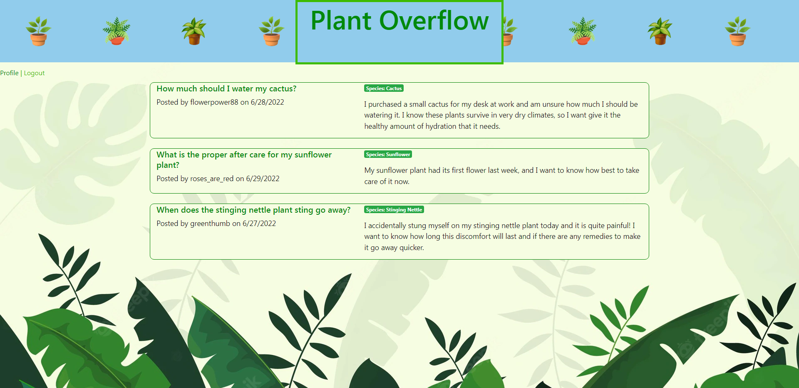
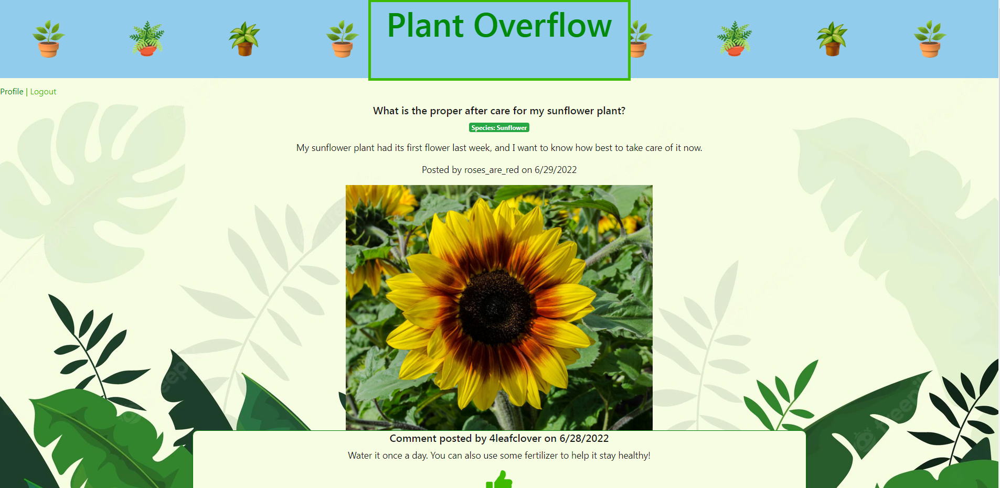

# Plant Overflow

## Description

This repository contains a full-stack application where users could post and answer questions about plants and gardening. The application features login functionality, node.js, express.js, handlebar.js as a templating engine, MySQL, Sequelize, MVC, GET routes, POST routes, and MySQL models.    

During the pandemic many people adopted plant babies. With their new found green thumb, came a lot of green questions. We envision a community where expert gardeners and novice gardeners come together to find the best answers to the most relevant questions. 

Gardening is a *growing* community and through Plant Overflow, you can be a part of it too. 

## Usage

Through the terminal, install the required tools using the following: 

```
npm i
```
Through the terminal, seed the database using the following: 

```
npm run seed
```

Through the terminal, initialize the application using the following:

```
npm start
```

This website can be accessed at https://beautiful-glacier-bay-92549.herokuapp.com/.

Below are some screenshots of the deployed website. 



